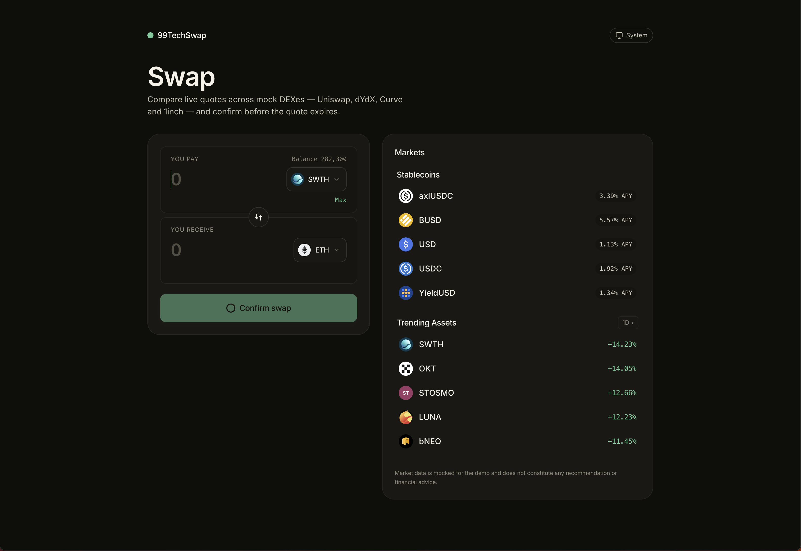
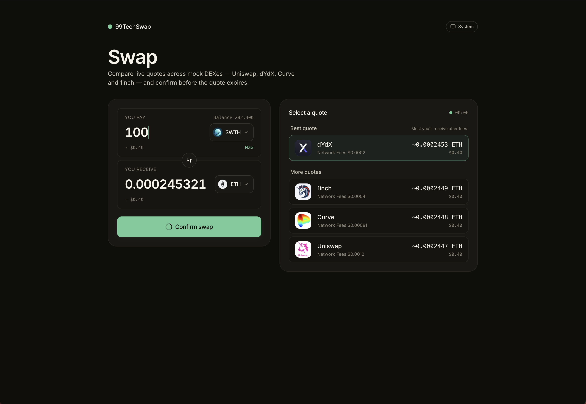

# Code Challenge

Three problems, each in its own folder. Open the linked README for the full write-up — design choices, trade-offs, and run instructions.

| Problem | Topic | Stack | Read |
|---|---|---|---|
| **[Problem 1](./src/problem1/README.md)** | Three implementations of `sum_to_n(n)` with shared contract, IEEE 754 reasoning, and a micro-benchmark | Node, plain JS, `node:test` | [`src/problem1/`](./src/problem1/) |
| **[Problem 2](./src/problem2/README.md)** | 99TechSwap — currency-swap form with multi-DEX comparison, live insufficient-balance feedback, and quote countdown · **[Live demo ↗](https://code-challenge-sandy.vercel.app/)** | Vite, React 18, TypeScript strict, Tailwind, RHF + Zod, TanStack Query, Vitest | [`src/problem2/`](./src/problem2/) |
| **[Problem 3](./src/problem3/SOLUTION.md)** | Code review and refactor of `WalletPage` — 14 issues ranked by severity, single-file refactor, pure-helper tests | React + TypeScript | [`src/problem3/`](./src/problem3/) |

## Problem 2 preview

<p align="center">
  
</p>

<p align="center">
  
</p>

## Repo layout

```
src/
├── problem1/   sum_to_n implementations + tests + benchmark
├── problem2/   99TechSwap (full Vite app)
└── problem3/   WalletPage refactor (single-file delivery: index.tsx + index.test.ts + SOLUTION.md)
```

Each problem is self-contained — `cd` into its folder, follow the README's `Run` section.
